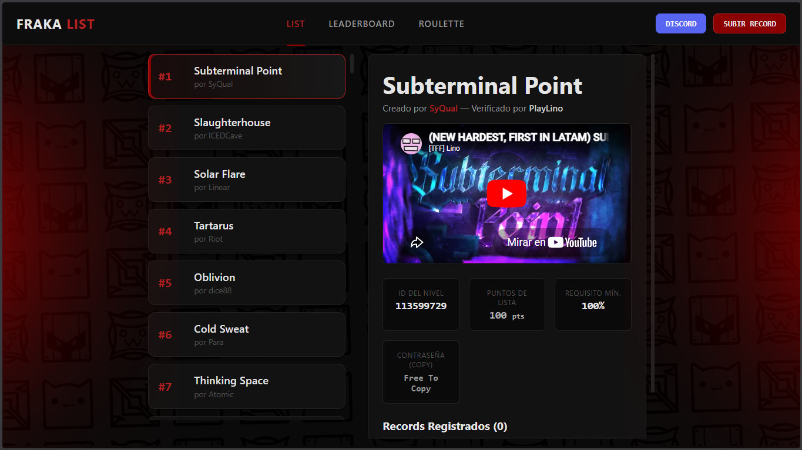

# FRAKA LIST

Una página web con una lista de niveles estilo "demon list" con soporte para ver detalles de cada nivel, un ranking de jugadores y un minijuego de ruleta.

## ¿Qué es?

`FRAKA LIST` es una interfaz web estática pensada para explorar y consultar una lista de niveles de dificultad, ver información detallada del nivel, revisar puntuaciones globales y jugar una ruleta que propone niveles aleatorios para completar. Todo esto recopilado por records de la comunidad **Fraka clan**

## Cómo funciona

La página está construida con HTML, CSS y JavaScript puro. Los datos principales provienen de archivos JSON ubicados en `data-lvl/`, donde cada nivel tiene su propia definición.

Los archivos principales son:

- `index.html`: Estructura HTML, tres secciones principales (List, Leaderboard, Roulette) y contenedores para inyección dinámica.
- `main.js`: Inicialización del sitio, carga de datos JSON, renderizado de listas y gestión de la navegación entre pestañas.
- `assets/css/`: Sistema modular de estilos con variables CSS globales, componentes reutilizables y estilos específicos por sección.
- `assets/js/`: Scripts adicionales para leaderboard dinámico, interfaz móvil y ajustes de UX.

## Página web

[Pagina principal de la lista](https://the-fraka-list.github.io/Fraka-List.v2/)

## Preview




## Pestañas principales

La interfaz tiene tres pestañas en la barra de navegación:

1. **List**
   - Muestra un listado de niveles disponibles los cuales son los records de la comunidad.
   - Permite seleccionar un nivel para ver su detalle, con información como creador, verificador, ID del nivel, puntos de lista, requisito mínimo y contraseña.
   - Inserta un video de verificación si la información del nivel incluye una URL de YouTube.

2. **Leaderboard**
   - Calcula un ranking global de jugadores basado en los datos disponibles en los niveles.
   - Muestra puntos totales, cantidad de niveles completados, progresos y el récord más difícil registrado por cada jugador.

3. **Roulette**
   - Minijuego que genera una lista aleatoria de niveles para completar.
   - Permite registrar el porcentaje completado de cada nivel y avanzar en la ruleta.
   - Guarda el progreso en `localStorage` para mantener la sesión.
   - Incluye opciones para importar/ exportar el progreso en formato JSON.

## Estructura del proyecto

```
index.html          # Página principal
main.js             # Lógica core: carga de datos, navegación y renderizado
assets/
  css/
    variables.css   # Variables globales (colores, espacios, tipografía)
    nav.css         # Estilos de la barra de navegación
    components.css  # Componentes reutilizables (cards, botones, etc)
    roulette.css    # Estilos específicos de la ruleta
    mobile.css      # Estilos responsivos y adaptaciones móvil
  img/              # Imágenes y assets visuales
  js/
    leaderboard.js  # Cálculo dinámico del ranking y puntos de jugadores
    mobile-hamburger.js # Menú hamburguesa para dispositivos móviles
    mobile-patch.js # Ajustes y parches para mejorar UX en móvil
data-lvl/           # Niveles individuales en formato JSON
```

## Datos de niveles

Cada nivel se describe en un archivo JSON dentro de `data-lvl/`. El sistema funciona con un índice maestro (`_list.json`) que contiene la lista de archivos a cargar, permitiendo un control más flexible sobre el orden y qué niveles incluir.

Cuando la página carga, `main.js` realiza lo siguiente:
1. Fetch del archivo `_list.json` para obtener la lista de niveles
2. Carga asincrónica de todos los archivos JSON de niveles
3. Asignación automática de rank según el orden en la lista
4. Renderizado del sidebar y cálculo del leaderboard

Ejemplos de campos que puede incluir un nivel:

- `id` - Identificador único del nivel
- `name` - Nombre del nivel
- `rank` - Posición en la lista (asignada automáticamente)
- `percentToQualify` - Porcentaje mínimo para clasificar
- `verification` - URL de video de verificación (YouTube)
- `creators` - Lista de creadores del nivel
- `verifier` - Jugador que verificó el nivel
- `password` - Contraseña para ingresar al nivel
- `records` - Array de jugadores que han completado el nivel con datos de progreso

## Soporte responsivo

La aplicación está diseñada para funcionar en dispositivos móviles y de escritorio. El sistema responsivo incluye:

- **Menú hamburguesa** - En dispositivos móviles, la navegación se convierte en un menú desplegable
- **Layouts adaptables** - La interfaz se reorganiza automáticamente según el tamaño de pantalla
- **Sistema de variables CSS** - `variables.css` define espacios, colores y tipografía escalables
- **Componentes optimizados** - Tarjetas, botones y elementos se redimensionan para pantallas pequeñas

Los scripts `mobile-hamburger.js` y `mobile-patch.js` se encargan de inyectar la interfaz móvil y manejar ajustes específicos para una mejor experiencia en teléfonos y tablets.

## Uso local

1. Abre `index.html` en un navegador moderno.
2. Navega entre las pestañas `List`, `Leaderboard` y `Roulette`.
3. En la pestaña `List`, haz clic en un nivel para ver sus detalles.
4. En `Roulette`, inicia la ruleta y registra tu progreso en cada nivel.

## Notas

- La navegación entre pestañas se realiza con botones que activan/desactivan secciones mediante JavaScript.
- El **leaderboard** calcula dinámicamente los puntos de cada jugador basándose en la dificultad del nivel y la posición en el ranking.
- El minijuego de **ruleta** usa `localStorage` para mantener el estado entre recargas, permitiendo al usuario retomar su progreso.
- El sistema utiliza **variables CSS** (`variables.css`) para mantener consistencia visual y permitir cambios globales de tema sin modificar múltiples archivos.
- Los datos se cargan de forma **asincrónica** usando `fetch()` para evitar bloqueos en la interfaz durante la carga de múltiples archivos JSON.
- El sitio es **completamente estático** - no requiere backend, ideal para hospedaje en GitHub Pages u otros servicios de hosting estático.

